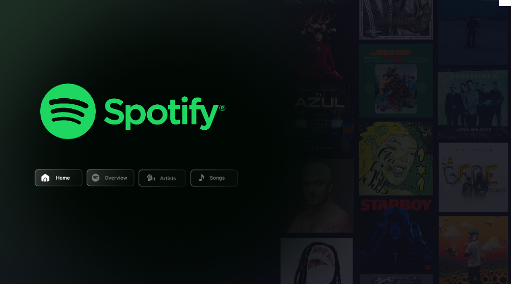
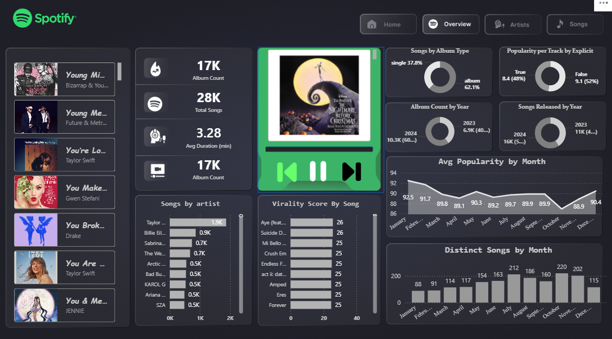
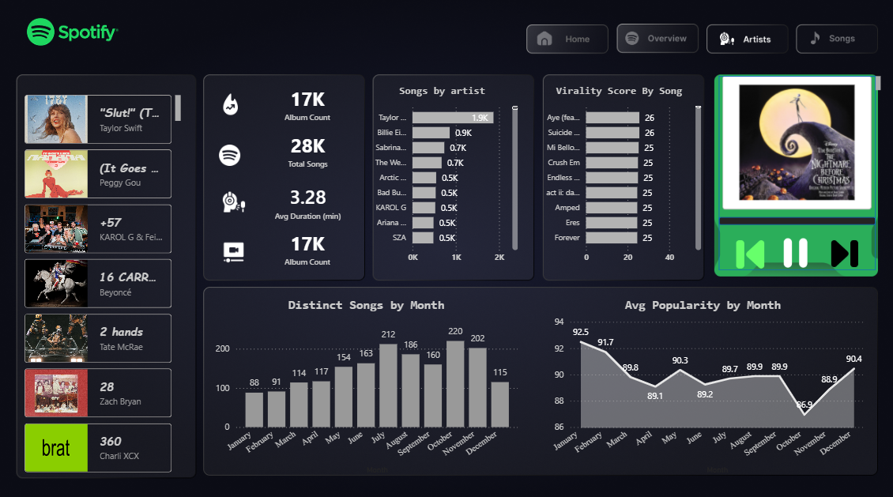
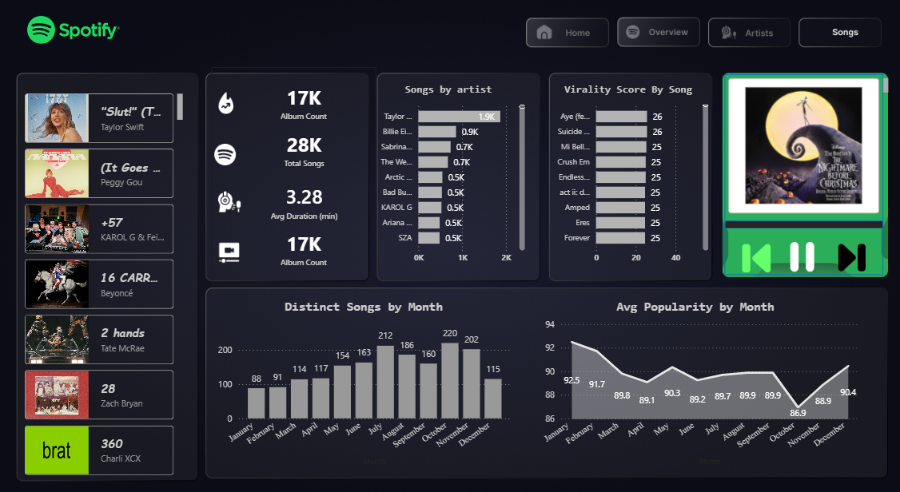

# 🎧 Spotify Analytics Dashboard (Power BI)

An interactive **Spotify Data Analytics Dashboard** built using **Power BI** to analyze music trends, artist performance, and song popularity.

---

## 📌 Overview

This project provides insights into Spotify data including:

- 🎵 Song trends and virality
- 🎤 Artist-wise song distribution
- 📊 Monthly song releases
- ⭐ Popularity analysis
- 💽 Album statistics

The dashboard is designed with a **modern dark UI theme** inspired by Spotify.

---

## 🚀 Features

- 📈 **Songs by Artist Analysis**
- 🔥 **Virality Score by Song**
- 📅 **Monthly Trends (Songs & Popularity)**
- 💿 **Album Count & Distribution**
- 🎧 **Interactive Music Player UI**
- 🎯 **Filters & Navigation (Home, Overview, Artists, Songs)**

---

## 🖼️ Dashboard Preview

### 🏠 Home Screen

---

### 📊 Overview Dashboard

---

### 📊 Analytics Dashboard

---

### 🎵 Songs View

---

## 🛠️ Tools & Technologies

- **Power BI**
- **Data Visualization**
- **DAX (Data Analysis Expressions)**
- **Spotify Dataset**

---

## ⚡ How to Use

1. Download the `.pbix` file
2. Open it in **Power BI Desktop**
3. Explore dashboards using navigation buttons
4. Apply filters for deeper insights

---

## 👩‍💻 Author

**Kanishka Rani**  
Computer Science Engineering Student  
